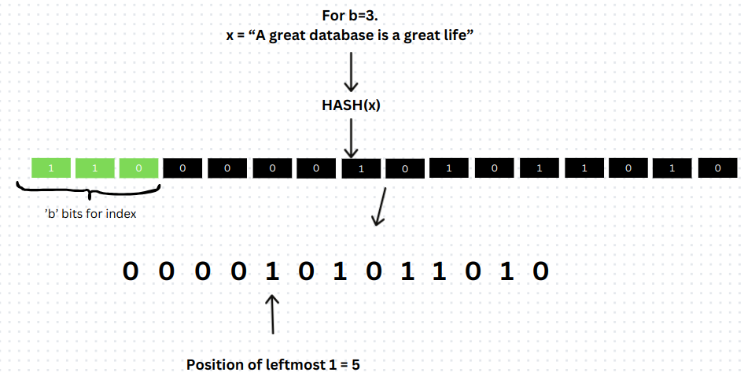
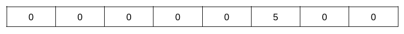
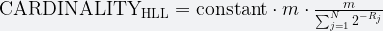

# Project #0 - C++ Primer
## 项目说明
考虑跟踪一个网站在单日内访问的独立用户数量的问题。虽然对于一个小型网站，只有少数人访问，这个问题是简单的，但当处理一个拥有数十亿用户的大型网站时，问题变得更加复杂。在这种情况下，存储每个用户在列表中并检查重复项是不切实际的。庞大的数据量会导致显著的挑战，包括内存不足、处理时间缓慢以及其他低效问题。

**HyperLogLog (HLL)** 是一种基于概率的计数数据结构，用于跟踪大型数据集的基数（即不同元素的数量）。HyperLogLog 适用于像上述场景，在这些场景中，目标是计算大量数据流中的唯一项的数量，而不需要显式存储每一项。HLL 通过巧妙的哈希机制和紧凑的数据结构提供对唯一用户数量的准确估计，同时只使用传统方法所需内存的一小部分。这使得 HLL 成为现代数据库分析中的重要工具。

HLL 提供了基于以下参数的概率计数机制：

* b - 哈希值二进制表示中的初始位数
* m - 寄存器数量（也称为桶） - 可以被看作是一个内存块，它等于 2^b。（当讨论 HyperLogLog 和任务时，“桶”和“寄存器”可以互换使用）
* p - 1的最左边位置（即 MSB 1 的位置）

考虑一个简单的例子，使用字符串 "A great database is a great life"。
1. 首先，将该字符串哈希为一个哈希值，然后将其转换为二进制表示;从最重要的位（MSB）开始,根据哈希值（以二进制形式），提取出 b 位;根据提取出的位，计算寄存器值。（默认情况下，每个寄存器的值为 0）。

2. 从剩余的位中，得到左边第一个 1 的位置（即 MSB），即从左边开始的零位数加 1（如下面的图示所给）

3. 寄存器值为提取出的b位组成的数（此处为6）。即：6号寄存器处值为：`max(register[6], p)`；

4. 在所有元素添加到寄存器中后，计算基数：（寄存器数量为m）

    * 有：constant = 0.79402；R[j] 下标为j的寄存器中的数值； N = m.
